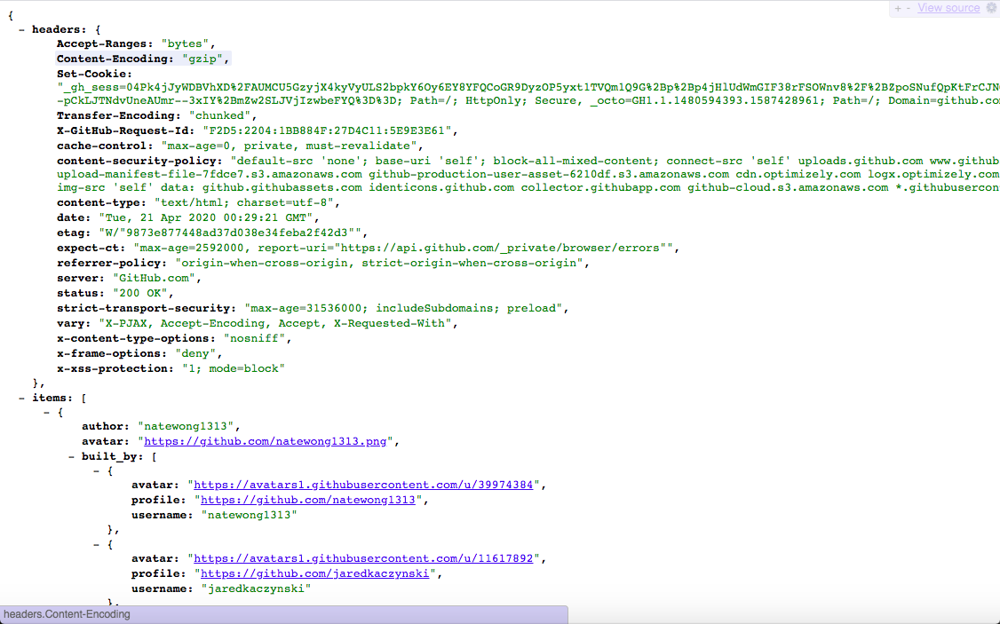

<h1 align="center">GitHub API Client</h1>
<p align="center"><a href="https://circleci.com/gh/lightning-dabbler/github-api-client" target="_blank">
</a></p>


> :octocat: [GitHub REST API v3]

# Table of Contents
- [Requirements](#requirements)
- [Run App:](#run-app)
- [APIs](#apis)
- [API Usage Examples](#api-usage-examples)
    - [Search](#search)
        - [Repositories](#search-repositories)
        - [Users](#search-users)
        - [Commits](#search-commits)
    - [GitHub Emojis](#github-emojis)
    - [Trending](#trending)
        - [Repositories](#trending-repositories)
        - [Developers](#trending-developers)
- [Visuals](#visuals)
  - [Home Page](#home-page)
  - [Search Page](#search-page)
  - [404](#404)
  - [API](#api)
- [Tech](#tech)
- [Author](#author)

## Requirements
- [Docker] Engine version 18.06.0+
- [Docker-Compose] version 1.22.0+

## Run App:
```bash
sh prod_run.sh # http://localhost:80
```

APIs
---
- [api/modules/] 
    - [emojis.py] & [search.py] utilizes [GitHub REST API v3]
    - [trending.py] scrapes data from https://github.com for trending repositories/developers

API Usage Examples
----

## Search

### Repositories <a id="search-repositories"></a>
- [Example 1](http://localhost:80/api/search/repositories/stars:>1+forks:>1?sort=stars+forks&order=desc)

Response
```json
{
    "headers":{
        ...
    },
    "items":[
        {
      "archive_url": "https://api.github.com/repos/freeCodeCamp/freeCodeCamp/{archive_format}{/ref}", 
      "archived": false, 
      "assignees_url": "https://api.github.com/repos/freeCodeCamp/freeCodeCamp/assignees{/user}", 
        ...
      "default_branch": "master", 
      "deployments_url": "https://api.github.com/repos/freeCodeCamp/freeCodeCamp/deployments", 
      "description": "freeCodeCamp.org's open source codebase and curriculum. Learn to code for free together with millions of people.", 
      "disabled": false, 
      ...
        },
        ...
    ],
    "status_code": 200
}
```

### Users <a id="search-users"></a>
- [Example 2](http://localhost:80/api/search/users/lightn?)

Response
```json
{
    "headers":{
        ...
    },
    "items": [
    {
      "avatar_url": "https://avatars3.githubusercontent.com/u/3190659?v=4", 
      "events_url": "https://api.github.com/users/Lightn/events{/privacy}", 
      "followers_url": "https://api.github.com/users/Lightn/followers", 
      "following_url": "https://api.github.com/users/Lightn/following{/other_user}", 
      "gists_url": "https://api.github.com/users/Lightn/gists{/gist_id}", 
      ...
    },
    ...
    ],
    "status_code": 200
}
```
### Commits <a id="search-commits"></a>
- [Example 3](http://localhost:80/api/search/commits/test+repo:vuejs/vue)

Response
```json
  {
      "headers":{
          ...
      },
  "items": [
    {
      "author": {
        "avatar_url": "https://avatars1.githubusercontent.com/u/17667652?v=4", 
        ...
        "login": "hareku", 
        "node_id": "MDQ6VXNlcjE3NjY3NjUy", 
        "organizations_url": "https://api.github.com/users/hareku/orgs", 
        "received_events_url": "https://api.github.com/users/hareku/received_events", 
        "repos_url": "https://api.github.com/users/hareku/repos", 
        "site_admin": false, 
        "starred_url": "https://api.github.com/users/hareku/starred{/owner}{/repo}", 
        "subscriptions_url": "https://api.github.com/users/hareku/subscriptions", 
        "type": "User", 
        "url": "https://api.github.com/users/hareku"
      }, 
      "comments_url": "https://api.github.com/repos/vuejs/vue/commits/841bb084ca288e142b1958346bb1182bf6f0a564/comments", 
      "commit": {
          ...
          }
    ...
    },
    ...
  ],
  "status_code": 200
  }
```
## GitHub Emojis
- [Example 4a](http://localhost:80/api/emojis)

Response
```json
{
    "headers":{
        ...
    },
  "items": {
    "+1": "https://github.githubassets.com/images/icons/emoji/unicode/1f44d.png?v8", 
    "-1": "https://github.githubassets.com/images/icons/emoji/unicode/1f44e.png?v8", 
    "100": "https://github.githubassets.com/images/icons/emoji/unicode/1f4af.png?v8", 
    "1234": "https://github.githubassets.com/images/icons/emoji/unicode/1f522.png?v8",
    ...
  },
  "status_code": 200
}
```

- [Example 4b](http://localhost:80/api/emojis?emoji=octocat)

## Trending

### Repositories <a id="trending-repositories"></a>
- [Example 5a](http://localhost:80/api/trending)
- [Example 5b](http://localhost:80/api/trending?since=weekly)

Response
```json
{
    "headers":{
        ...
    },
  "items": [
    ...
    {
      "author": "ahertel",
      "avatar": "https://github.com/ahertel.png",
      "built_by": [
        {
        "avatar": "https://avatars0.githubusercontent.com/u/3003066",
        "profile": "https://github.com/ahertel",
        "username": "ahertel"
        },
        {
        "avatar": "https://avatars3.githubusercontent.com/u/7012513",
        "profile": "https://github.com/antoniablair",
        "username": "antoniablair"
        }
    ],
      "description": "A Mac tool that finds available delivery slots for Amazon's Whole Foods delivery and Amazon Fresh services",
      "forks": 145,
      "language_color": "#101F1F",
      "name": "Amazon-Fresh-Whole-Foods-delivery-slot-finder",
      "present_freq_stars": "381 stars this week",
      "programming_language": "AppleScript",
      "stars": 874,
      "url": "https://github.com/ahertel/Amazon-Fresh-Whole-Foods-delivery-slot-finder"
    },
    ...
  ],
  "status_code": 200
}
```

### Developers <a id="trending-developers"></a>
- [Example 6a](http://localhost:80/api/trending?developers=true)
- [Example 6b](http://localhost:80/api/trending?developers=true&since=monthly)

Response
```json
{
    "headers":{
        ...
    },
  "items": [
    {
      "avatar": "https://avatars0.githubusercontent.com/u/317464", 
      "name": "Sa\u00fal Ibarra Corretg\u00e9", 
      "popular_repository": {
        "description": "Python interface for libuv", 
        "name": "pyuv", 
        "url": "https://github.com/saghul/pyuv"
      }, 
      "profile": "https://github.com/saghul", 
      "username": "saghul"
    },
    ...
  ],
    "status_code": 200
}
```
## Visuals
### Home Page

<p align="center">
    
    </p>
<table>
    <tr><th>Developers</th><th>Repositories</th></tr>
    <tr><td valign="top"></td><td valign="top"></td></tr>
    </table>

### Search Page

<p align="center">
    
    </p>
<table>
    <tr><th>Users</th><th>Repositories</th><th>Commits</th></tr>
    <tr><td valign="top"></td><td valign="top"></td>
    <td valign="top"></td></tr>
    </table>

### 404

<p align="center">
    
    </p>

### API

<p align="center">

</p>
<p align="center">

</p>

Tech 
------
* [Flask]
* [Mamba]
* [Beautifulsoup4]
* [Docker]
* [Docker-Compose]
* [Redis]
* [Node-Redis]
* [Gunicorn]
* [Redis-Python-API]
* [Vue.js]
* [Vue Router]
* [Vuex]
* [Bootstrap]
* [Nginx]

Author
--------
* Osarodion Irabor

[Flask]: http://flask.pocoo.org/
[GitHub REST API v3]: https://developer.github.com/v3/
[Mamba]: https://pypi.org/project/mamba/
[Docker]: https://docs.docker.com/engine/reference/builder/#usage
[Docker-Compose]: https://docs.docker.com/compose/compose-file/
[Beautifulsoup4]: https://pypi.org/project/beautifulsoup4/
[emojis.py]:./api/modules/emojis.py
[search.py]:./api/modules/search.py
[trending.py]:./api/modules/trending.py
[api/modules/]:./api/modules/
[Redis]: https://redis.io/
[Node-Redis]:https://github.com/NodeRedis/node-redis
[Gunicorn]:https://gunicorn.org/
[Redis-Python-API]:https://github.com/andymccurdy/redis-py
[Vue.js]:https://vuejs.org/
[Vue Router]:https://router.vuejs.org/
[Vuex]:https://vuex.vuejs.org/
[Nginx]:https://www.nginx.com/
[Bootstrap]:https://getbootstrap.com/